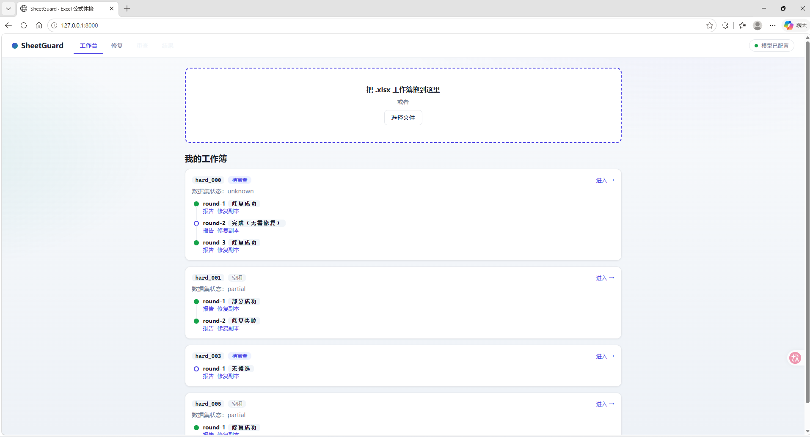
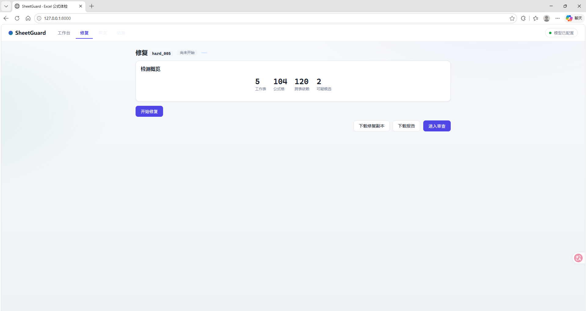
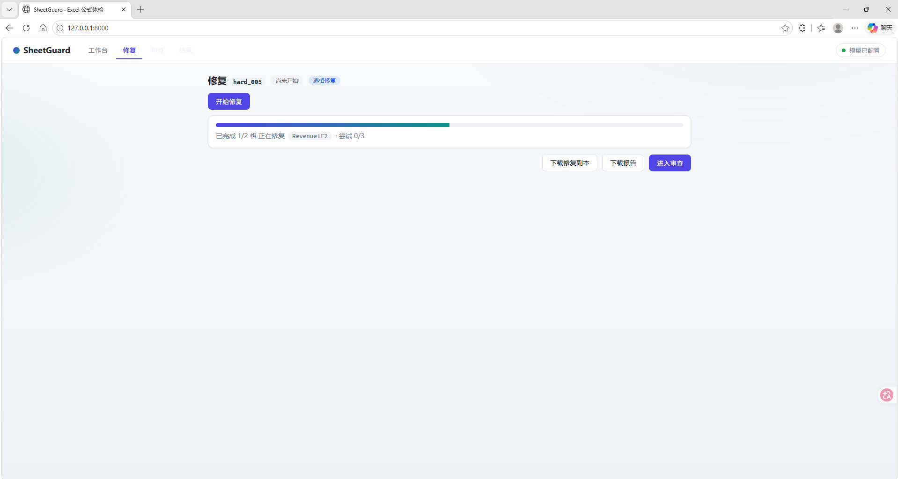
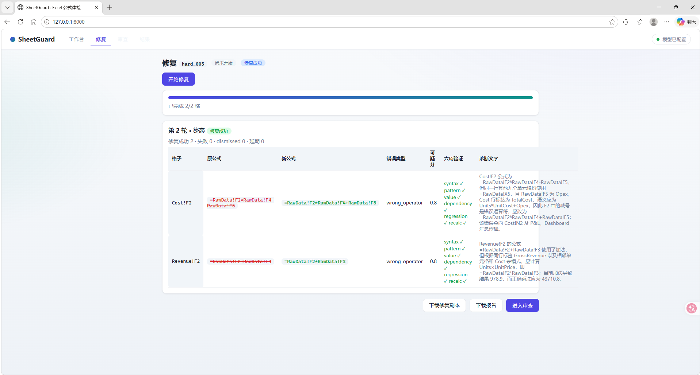
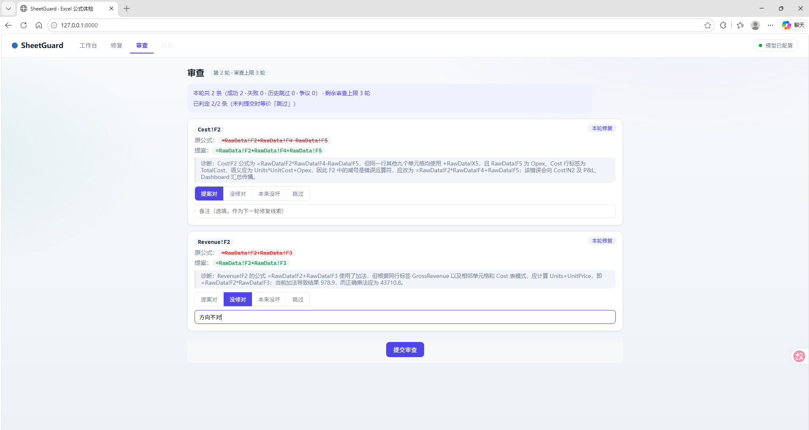
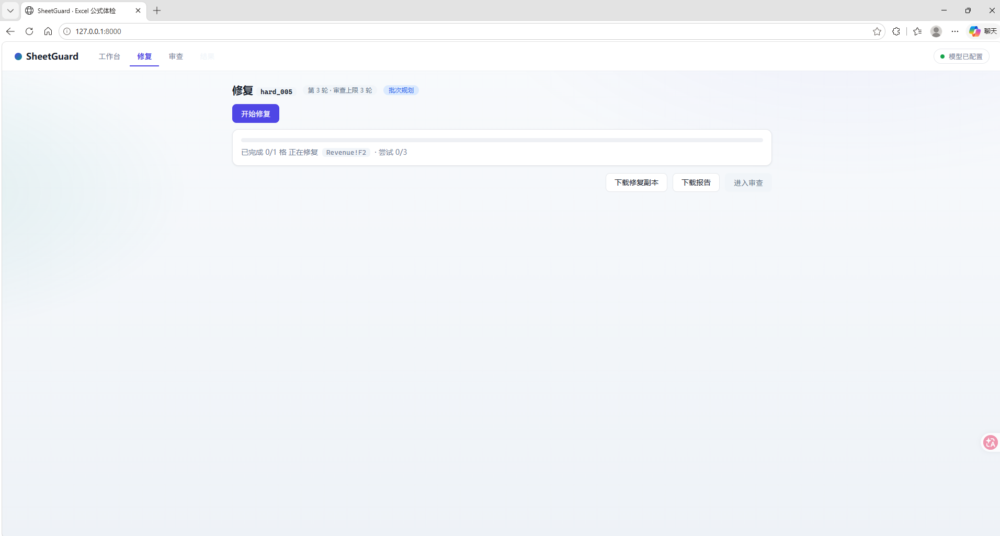
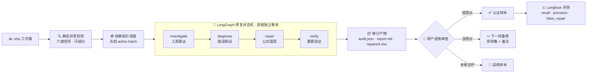

<div align="center">

# 🛡️ SheetGuard

**Excel 公式体检与修复 Agent — 让每一格公式都值得信任**

基于 LangGraph 的表格公式智能检查、诊断与自动修复系统

[](https://www.python.org/)
[](https://www.langchain.com/)
[](https://fastapi.tiangolo.com/)
[](LICENSE)

</div>

---

## 💡 这是什么

Excel 报表里的公式错误是最常见的"沉默事故"：一个抄错的引用、一段复制漏行的 SUM，不会报错，只会让下游的数字悄悄错掉。

**SheetGuard 是一个端到端解决这个问题的 LLM Agent**——把工作簿交给它，它会像一位严格的审计员那样：静态扫描可疑公式 → 逐格取证调查 → 给出错误假设 → 生成修复提案 → **用重算引擎验证修复是否正确** → 输出审计报告，再把每一格的裁决权交给用户，用户反馈沉淀为数据集反哺评测。

> 核心理念：**修复必须被验证，而不是被相信。** 每一个提案都要经过重算引擎 + 结构检查的双重验证；验证不了的（证据不足、公式越界）宁可标记失败也不误修——**全实验周期误修（false repair）保持为 0**。

## ✨ 核心特性

- 🔁 **LangGraph 多单元格修复状态机** — `investigate → diagnose → repair → verify` 节点编排，有界重试（max_attempts），copy-on-write 工作簿事务，失败的尝试不污染对话上下文；
- 🔍 **工具调用调查循环** — 模型主动调用"读取单元格 / 依赖图 / 同家族公式"等工具取证，证据不足输出 `unresolved` 而不是硬修；
- 🧮 **自研重算验证引擎** — 实现 Excel 公式子集语义（`SUM/AVERAGE/MIN/MAX/COUNT/IF/SUMIF/COUNTIF/VLOOKUP` + 依赖传播），修复提案经重算差分 + 结构六项检查双重验证；
- 🕸️ **依赖拓扑调度** — 候选按 hard prerequisites 排序逐格修复，上游修复结果实时反哺下游判断，超预算候选智能延期（deferred）；
- 📊 **评测驱动开发** — 覆盖矩阵 / 多错误批次 / 真实用户反馈数据集接入 Langfuse，每轮版本迭代跑实验对比 recall / precision / false_repair / formula_accuracy；
- 👤 **用户反馈闭环** — 网页逐格审查（提案对 / 没修对 / 本来没坏 / 跳过）→ 被否格自动触发下一轮重修（携带排除集与用户备注）→ 认证格沉淀为金标准数据集；
- 🌐 **本地 Web 入口** — FastAPI + 原生前端：上传即出检测概览、修复过程逐格实时进度、审查结果一键回写。

## 🖥️ 界面预览

| 工作台（轮次时间线） | 检测概览（上传即出） |
|---|---|
|  |  |

| 修复实时进度（逐格推进） | 审计报告（原公式 → 新公式对照） |
|---|---|
|  |  |

| 逐格审查（四键位裁决 + 备注） | 被否自动触发下一轮重修 |
|---|---|
|  |  |

## 🏗️ 系统架构



每一格的修复都是独立事务：调查（工具取证）→ 诊断（错误假设）→ 修复（公式提案）→ 验证（重算引擎 + 结构检查），验证不通过自动回滚到原公式——**原始工作簿永不原地修改**。

## 📊 评测指标

**`sheetguard-repair-multi-batch-v1` 数据集**（30 个多错误工作簿：每表 3~6 个错误、共 123 个错误，5 类错误类型均衡，LLM 端到端真实运行）：

| 指标 | 结果 | 含义 |
|---|---|---|
| `repair_recall` | **0.960** | 目标错误格的修复召回（该修的修了多少） |
| `repair_precision` | **1.000** | 修的格子全部是真实错误（目标选择零失误） |
| `false_repair` | **0** | 零误修——没把任何一个正常公式改坏 |
| `formula_accuracy` | **0.946** | 修复公式与标准答案逐字一致（117/123） |
| `workbook_status` | **0.833** | 25/30 张表完全成功 |

**`sheetguard-repair-coverage-v1` 数据集**（覆盖矩阵：9 个重算引擎函数 + 四则表达式形态 × 5 类错误类型的全部 33 个可注入组合 + 1 个五故障混合）与 `sheetguard-repair-complete-v1` 数据集（21 个精选工作簿，`repair_recall / precision 均 1.0、false_repair 0`）继续作为回归基线。

> 指标在 Langfuse 数据集上持续复跑对比（v1.6 → v1.14，`false_repair` 从未破零）；数据集由生成器合成（固定种子可复现）+ 真实用户反馈双源构成，评测器与修复管线解耦。当前失败模式集中在条件聚合（COUNTIF/SUMIF）criteria 边界反推（4/123 格），已定位为下一轮迭代目标。

## 🧪 数据集设计：公式形态 × 错误类型覆盖矩阵

评测集不是手挑样本，而是先画覆盖矩阵再生成：**行 = 支持的公式/表达式形态（9 个重算引擎函数 + 四则运算），列 = 5 类错误类型**。33 个可注入组合每个对应一个测试案例（`cov_000..032`，另加 1 个五故障混合 `cov_033`），矩阵空格都有书面理由，不留"没交代"的死角：

| 载体形态 | 范围漏算 | 引用错位 | 运算符 | 硬编码 | 跨表换源 |
|---|---|---|---|---|---|
| SUM / AVERAGE / MIN / MAX | ✓ | —¹ | —² | ✓ | ✓ |
| COUNT | ✓ | —¹ | —² | ✓ | —³ |
| IF（比较表达式） | —⁴ | ✓ | ✓ | ✓ | ✓ |
| VLOOKUP（布尔 FALSE） | ✓ | ✓ | —² | ✓ | ✓ |
| SUMIF / COUNTIF（字符串 criteria） | ✓ | ✓⁵ | —⁶ | ✓ | ✓ |
| 四则运算 | —⁴ | ✓ | ✓ | ✓ | ✓ |

N/A 不是漏测，是语义/静态不可锚定：¹ 纯范围聚合只有范围引用，"引用错位"语义并入范围漏算；² 公式内无运算符可错；³ COUNT 对全数值行计数恒等于格数（值中性，会被按"值正确"驳回）；⁴ 该行公式没有范围引用，"范围漏算"无载体；⁶ criteria 运算符在字符串常量内，静态信号结构上不可见且行尾聚合格豁免兜底（探针实测候选集为空）。而 ⁵ 是**覆盖方式说明**而非 N/A：该行的"引用错位"由 SUMIF 的 sum_range 整体错列一格表达（cov_023），非原子单格位移；COUNTIF 没有第二个范围参数，该对由 SUMIF 单独承载。

**生成管线（固定种子可复现）**：每个案例复制 gold 工作簿 → 注入指定错误 → 过两道守门才入库：① 静态候选集必须恰为注入目标（无多报、无漏报）；② 把标准答案写回必须通过 Verifier 六项检查（missing_formula 另加"常量唯一性"守门——同一常量不能被第二个聚合公式复现，否则值反推退化成抽奖）。多错误批次数据集（30 表 / 123 错误）再从矩阵模板池按错误类型轮转采样生成，每个工作簿同样过双守门。

## 🚀 快速开始

```powershell
git clone https://github.com/liyumini/SheetGuard.git
cd SheetGuard/sheetguard-agent

# 安装（Python 3.11+）
python -m venv .venv
.\.venv\Scripts\python.exe -m pip install -e ".[dev,web]"

# 配置模型（OpenAI 兼容接口，改 .env 即可换 provider）
copy .env.example .env    # 填入 OPENAI_API_KEY / OPENAI_MODEL

# 三种使用方式
.\.venv\Scripts\sheetguard inspect demo.xlsx      # ① 静态体检（离线，秒级）
.\.venv\Scripts\sheetguard repair demo.xlsx       # ② 一键修复（Agent 全流程）
.\.venv\Scripts\sheetguard web                    # ③ 网页入口（上传/进度/审查）
```

产物集中输出到 `out/<工作簿名>/round-N/`：审计 JSON（面向机器）、Markdown 报告（面向人工）、修复副本（原始文件不动）。

## 🧩 技术栈

| 层 | 技术 |
|---|---|
| Agent 编排 | LangGraph · LangChain（状态机、工具调用、有界重试） |
| 表格引擎 | openpyxl + 自研公式解析 / 依赖图 / 重算引擎（约 10 个模块） |
| 可观测性 | Langfuse（trace / 数据集 / 实验对比） |
| Web 入口 | FastAPI + 原生 HTML/JS/CSS（零前端依赖） |
| 工程化 | Typer CLI · YAML 行为配置 |

## 📁 项目结构

```
SheetGuard/
└── sheetguard-agent/
    ├── src/sheetguard/
    │   ├── agent/        # LangGraph 修复状态机（graph/state/prompts）
    │   ├── spreadsheet/  # 表格引擎：解析、异常检测、依赖图、重算、验证
    │   ├── tools/        # Agent 调查工具（读格子/家族公式/依赖）
    │   ├── app/          # CLI（Typer）· 报告渲染 · 审查服务层
    │   └── web/          # FastAPI 入口 + 前端静态资源
    ├── evaluation/       # 数据生成 · 评测器 · 实验 runner
    └── pyproject.toml
```

## 📄 License

[MIT](LICENSE)
